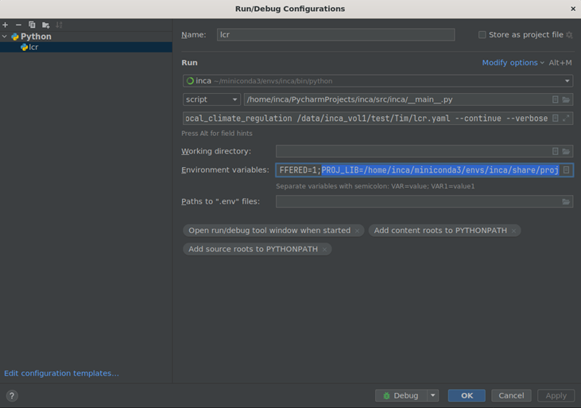

# eo_processing repository
repro for EO data processing pipelines in openEO

# WEED: Python development environment
## linux
- install miniconda
  ```
  sudo yum install wget
  mkdir -p ~/miniconda3
  wget https://repo.anaconda.com/miniconda/Miniconda3-latest-Linux-x86_64.sh -O ~/miniconda3/miniconda.sh
  bash ~/miniconda3/miniconda.sh -b -u -p ~/miniconda3
  rm -rf ~/miniconda3/miniconda.sh
  ~/miniconda3/bin/conda init bash
  ~/miniconda3/bin/conda init zsh
  ```
- if the conda env is not working in the terminal (sometimes it breaks on the terrascope VM)
→ run the `~/miniconda3/bin/conda init bash` command again
## windows
- install anaconda from webpage: https://repo.anaconda.com/archive/Anaconda3-2024.06-1-Windows-x86_64.exe
- or use the newest version from: https://www.anaconda.com/download/success
## setup the development environment in conda
- import environment by using the yml file in the repository
  ```
  conda env create -f <path>/weed_python_environment.yml
  ```
- OR create the dev environment in this order (win or linux) by hand
  ```
  conda create --name weed python=3.12
  conda activate weed
  conda update --all
  conda install -c conda-forge rasterio
  conda install -c conda-forge openeo
  conda install -c conda-forge geopandas
  conda install -c conda-forge notebook
  conda install -c conda-forge matplotlib
  conda install -c conda-forge rioxarray
  conda install -c conda-forge netCDF4
  conda install -c conda-forge scikit-image
  ```
- create a jupyter kernel for the weed environment in jupyter notebooks
  - set up a conda environment with all needed packages (see above)
  -	activate the environment e.g. `conda activate weed`
  - create a kervel for jupyter e.g. `ipython kernel install --user --name=weed` 
  - now in Jupyter you can select this Kernel or can create a new Notebook with that kernel (to start the notebooks just run `jupyter notebook` in your environment)

## PyCharm setting for the conda environment
- first do editable install of your python project you are working on 
  - cd in the working folder of your repro (mostly in PyCharmsProject the name of the cloned repository) with terminal
  - run `conda activate weed`
  -	run `python -m pip install -e .`
- activate the WEED conda env in your PyCharm project via the 'Interpreter settings'
- if you have issues in PyCharm debugging make sure to set the PROJ_LIB path in the debugging/run environment variables for GDAL (see image) 
--> otherwise gdal command can stop working \

- OR fix it permanently in your anaconda environment:
  - to add the PROJ_LIB or PROJ_DATA environment variables to the miniconda environment, you can use following commands.
  ```
  conda activate weed
  conda env config vars set PROJ_LIB=/home/<machine_name>/miniconda3/envs/weed/share/proj
  conda env config vars set PROJ_DATA=/home/<machine_name>/miniconda3/envs/weed/share/proj
  ```
  - you'll need to deactivate + activate again the weed environment for this to take effect
